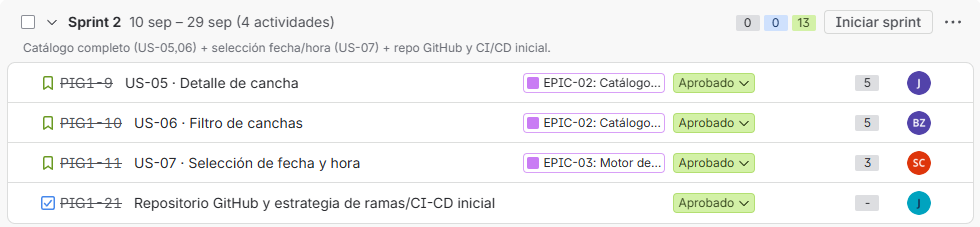
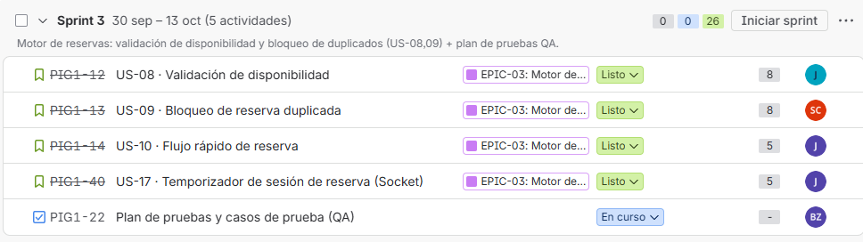
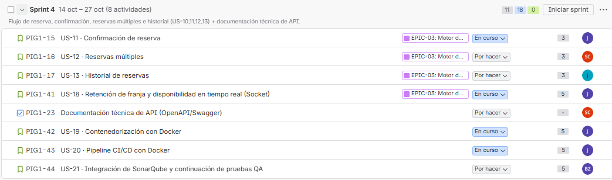
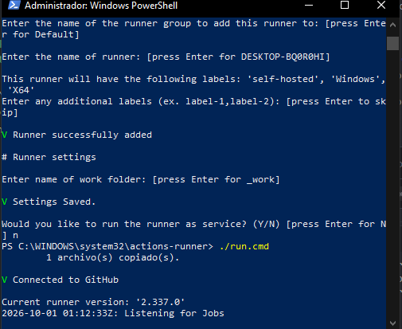
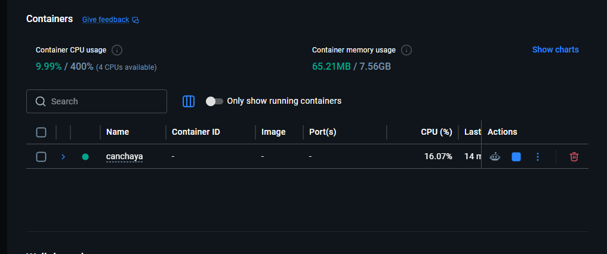
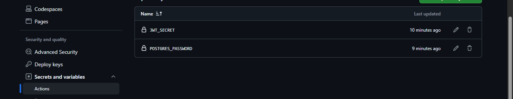

# CanchaYa — Sistema de reserva de canchas sintéticas

Proyecto Informático 1 — Universidad Autónoma de Occidente, Facultad de Ingeniería, 2026-2.

## Integrantes

- Samuel Rios Calderón (2230205)
- Juan Esteban Panesso Bernal (2215930)
- Juan Sebastian Castillo Acevedo (2231921)
- Byron Stiven Zapata Zapata (2210718)

**Docente:** Jorge Gonzalez Rivera

---

## Sprint Planning — Sprint 1

**Sprint:** Sprint 1 — 2 al 9 de septiembre de 2026 (1 semana)
**Tablero Jira:** Espacio CanchaYaUAO — proyecto PIG1

### Sprint Planning

**Objetivo:** Definir qué construirá el equipo durante el Sprint 1 y cómo lo hará.

**Cuándo:** Inicio del Sprint 1 (semana del 2 de septiembre de 2026).

**Duración:** 1 hora (sprint de 1 semana, según guía del curso).

**Rol de Product Owner:** Para este ejercicio académico, el equipo asumió la priorización de las HU sin la presencia formal del PO.

**Pasos realizados en la reunión de planeación:**

- El equipo revisó el Product Backlog (16 historias de usuario en 4 épicas) y priorizó las historias de la épica EPIC-01 (autenticación) por ser prerrequisito de todo el sistema, sumando el inicio del catálogo de canchas (EPIC-02).
- Se discutió cada historia seleccionada: alcance, dudas y tareas técnicas que implica.
- Se estimó el esfuerzo de cada historia en story points (escala usada en el Product Backlog).
- Se seleccionaron las historias que el equipo puede completar en una semana: US-01, US-02, US-03 y US-04 (11 puntos), conformando el Sprint Backlog.
- Se definió el objetivo del Sprint.
- Se detalló, para cada HU, su Definition of Done (criterios de aceptación) y se desagregó en tareas técnicas asignadas a un único responsable.

### Objetivo del Sprint 1

> "Al finalizar este Sprint, el sistema permitirá a un visitante registrarse, iniciar sesión, recuperar su contraseña y consultar el listado de canchas disponibles."

### Sprint Backlog

Historias de usuario seleccionadas del Product Backlog para el Sprint 1:

| ID | Historia de Usuario | Épica | Pts | Responsable |
|----|---------------------|-------|-----|-------------|
| US-01 | Como visitante, quiero registrarme con mis datos personales, para crear una cuenta y poder reservar canchas. | EPIC-01: Gestión de Usuarios | 3 | Juan Esteban Panesso |
| US-02 | Como usuario registrado, quiero iniciar sesión con mi correo y contraseña, para acceder a mis reservas. | EPIC-01: Gestión de Usuarios | 2 | Juan Esteban Panesso |
| US-03 | Como usuario registrado, quiero recuperar mi contraseña por correo electrónico, para retomar el acceso a mi cuenta si la olvidé. | EPIC-01: Gestión de Usuarios | 3 | Juan Esteban Panesso |
| US-04 | Como usuario autenticado, quiero ver el listado de canchas disponibles con su nombre y dirección, para elegir dónde jugar. | EPIC-02: Catálogo de Canchas | 3 | Samuel Rios Calderón |
| | **Total estimado del Sprint 1** | | **11 pts** | |

### Detalle de las Historias de Usuario

Para cada HU del Sprint Backlog se definió su Definition of Done (criterios de aceptación) y las tareas técnicas en que se desagrega, cada una asignada a un único integrante del equipo de desarrollo.

#### US-01 · Registro de usuario

*EPIC-01 · Gestión de Usuarios y Autenticación · 3 pts · Responsable HU: Juan Esteban Panesso*

Como visitante, quiero registrarme con mis datos personales, para crear una cuenta y poder reservar canchas.

**Definition of Done — Criterios de aceptación:**

- Dado que soy un visitante en la página de registro, cuando ingreso nombre, correo, teléfono y contraseña válidos y envío el formulario, entonces el sistema crea mi cuenta y me redirige a la pantalla de inicio de sesión.
- Dado que ingreso un correo ya registrado, cuando envío el formulario, entonces el sistema muestra un error indicando que el correo ya existe y no crea una cuenta duplicada.
- Dado que dejo campos obligatorios vacíos o la contraseña no cumple la política mínima, cuando intento enviar el formulario, entonces el sistema muestra los errores de validación y no envía la solicitud.
- Dado un registro exitoso, cuando se consulta la base de datos, entonces la contraseña queda almacenada cifrada con bcrypt (RNF-03).

**Tareas técnicas asignadas:**

| Tarea técnica | Responsable |
|---|---|
| Modelar tabla Usuario y migración en PostgreSQL | Juan Sebastián Castillo |
| Endpoint POST /api/auth/registro | Juan Esteban Panesso |
| Formulario de registro (UI) | Samuel Rios Calderón |
| Casos de prueba de aceptación de registro | Byron Zapata |

#### US-02 · Inicio de sesión

*EPIC-01 · Gestión de Usuarios y Autenticación · 2 pts · Responsable HU: Juan Esteban Panesso*

Como usuario registrado, quiero iniciar sesión con mi correo y contraseña, para acceder a mis reservas.

**Definition of Done — Criterios de aceptación:**

- Dado que soy un usuario registrado, cuando ingreso mi correo y contraseña correctos, entonces el sistema me autentica y me redirige a mi panel de reservas.
- Dado que ingreso credenciales incorrectas, cuando envío el formulario de login, entonces el sistema muestra un mensaje de error genérico sin indicar cuál campo es incorrecto.
- Dado que obtengo un token válido al iniciar sesión, cuando navego a una ruta protegida, entonces el sistema me permite el acceso sin pedir credenciales de nuevo.
- Dado que no tengo token o el token es inválido, cuando intento acceder a una ruta protegida, entonces el sistema me redirige al login (RNF-03).

**Tareas técnicas asignadas:**

| Tarea técnica | Responsable |
|---|---|
| Endpoint POST /api/auth/login | Juan Esteban Panesso |
| Formulario de login y manejo de sesión (UI) | Samuel Rios Calderón |
| Casos de prueba de aceptación de login | Byron Zapata |

#### US-03 · Recuperación de contraseña

*EPIC-01 · Gestión de Usuarios y Autenticación · 3 pts · Responsable HU: Juan Esteban Panesso*

Como usuario registrado, quiero recuperar mi contraseña por correo electrónico, para retomar el acceso a mi cuenta si la olvidé.

**Definition of Done — Criterios de aceptación:**

- Dado que soy un usuario registrado y olvidé mi contraseña, cuando solicito la recuperación con mi correo, entonces el sistema envía un enlace/código de restablecimiento a ese correo.
- Dado que recibo el enlace de recuperación, cuando defino una nueva contraseña válida, entonces el sistema la actualiza y me permite iniciar sesión con la nueva contraseña.
- Dado que el enlace de recuperación ya expiró o fue usado, cuando intento usarlo de nuevo, entonces el sistema rechaza la solicitud y me pide generar uno nuevo.
- Dado que ingreso un correo que no está registrado, cuando solicito la recuperación, entonces el sistema muestra un mensaje neutro sin confirmar ni negar la existencia de la cuenta.

**Tareas técnicas asignadas:**

| Tarea técnica | Responsable |
|---|---|
| Endpoint de recuperación de contraseña | Juan Esteban Panesso |
| Configurar proveedor de correo (SMTP/API) | Juan Sebastián Castillo |
| Pantalla 'Olvidé mi contraseña' (UI) | Samuel Rios Calderón |
| Casos de prueba de aceptación de recuperación | Byron Zapata |

#### US-04 · Listado de canchas disponibles

*EPIC-02 · Catálogo de Canchas · 3 pts · Responsable HU: Samuel Rios Calderón*

Como usuario autenticado, quiero ver el listado de canchas disponibles con su nombre y dirección, para elegir dónde jugar.

**Definition of Done — Criterios de aceptación:**

- Dado que soy un usuario autenticado, cuando accedo a la sección de canchas, entonces el sistema muestra el listado de canchas con nombre y dirección.
- Dado que no hay canchas registradas, cuando accedo al listado, entonces el sistema muestra un mensaje indicando que no hay canchas disponibles.
- Dado que el listado tiene varias canchas, cuando cargo la página, entonces el sistema responde en menos de 2 segundos para el 95% de las solicitudes (RNF-01).
- Dado que accedo desde un dispositivo móvil o de escritorio, cuando visualizo el listado, entonces la interfaz se renderiza correctamente entre 360px y 1920px de ancho (RNF-05).

**Tareas técnicas asignadas:**

| Tarea técnica | Responsable |
|---|---|
| Modelar tabla Cancha y datos semilla | Juan Sebastián Castillo |
| Endpoint GET /api/canchas | Juan Esteban Panesso |
| Vista de listado de canchas (UI responsive) | Samuel Rios Calderón |
| Casos de prueba de aceptación del listado | Byron Zapata |

### Distribución de tareas por integrante

Todos los integrantes del equipo, incluyendo el Scrum Master, tienen al menos una tarea técnica asignada dentro del Sprint 1:

| Integrante | Rol en el equipo | HU a cargo | Tareas técnicas asignadas |
|---|---|---|---|
| Juan Esteban Panesso Bernal | Backend · Scrum Master | US-01, US-02, US-03 | 4 (endpoints de auth y canchas) |
| Samuel Rios Calderón | Frontend | US-04 | 4 (formularios y vistas UI) |
| Juan Sebastián Castillo Acevedo | Base de datos / Concurrencia | — | 3 (modelos de datos e integración de correo) |
| Byron Stiven Zapata Zapata | Documentación / QA | — | 4 (casos de prueba de aceptación) |

### Próximas ceremonias del Sprint

- **Daily Scrum:** reunión diaria de 10-15 min durante todo el Sprint, para sincronizar avance y detectar bloqueos. Las HU se mueven en el tablero Kanban de Jira según su estado (Por hacer / En curso / Hecho).
- **Reunión previa a la Review:** un día antes de la Sprint Review, el equipo se reúne para organizar la presentación de avances (máx. 20 minutos).
- **Sprint Review:** miércoles 9 de septiembre, 6:30-8:30 p.m. Demo en vivo de las HU completadas que cumplen su Definition of Done; el docente (Product Owner) valida y da retroalimentación.
- **Sprint Retrospective:** al finalizar el Sprint Review, para reflexionar sobre el proceso de trabajo del equipo y definir mejoras para el Sprint 2.

### Enlace al tablero

Tablero Jira del equipo: espacio CanchaYaUAO — proyecto PIG1. El docente Jorge Gonzalez Rivera (jorgonzalez@uao.edu.co) fue agregado como miembro del espacio.

---

## Implementación técnica (Sprint 1)

Arquitectura por capas en frontend y backend, ambos en JavaScript. Base de datos relacional: **PostgreSQL**, según lo planteado por el equipo en la exposición de arquitectura.

El repositorio contiene dos proyectos npm independientes, `backend/` y `frontend/`, cada uno con su propio `package.json`. No hay un `package.json` en la raíz: entra a cada carpeta para instalar dependencias y correrlos (ver comandos más abajo en cada sección).

### Backend — `backend/`

Node.js + Express, arquitectura por capas, PostgreSQL (driver `pg`, SQL parametrizado) como base de datos.

```
backend/src/
├── config/        # variables de entorno y conexión (pool de PostgreSQL)
├── db/            # esquema SQL (schema.sql) y script de migración
├── models/        # mapeo fila SQL -> objeto de dominio (Usuario, Cancha, PasswordResetToken)
├── repositories/  # acceso a datos (consultas SQL)
├── services/      # lógica de negocio (auth, canchas, email)
├── controllers/   # manejadores de rutas
├── routes/        # definición de endpoints
├── middlewares/   # validación, autenticación JWT, manejo de errores
├── utils/         # JWT, política de contraseñas, tokens de recuperación
└── seed/          # datos semilla de canchas
```

**Tablas:** `usuarios`, `canchas`, `password_reset_tokens` (ver [backend/src/db/schema.sql](backend/src/db/schema.sql)).

**Endpoints:**

| Método | Ruta | Descripción | Protegido |
|---|---|---|---|
| POST | `/api/auth/registro` | Registro de usuario (US-01) | No |
| POST | `/api/auth/login` | Inicio de sesión (US-02) | No |
| POST | `/api/auth/olvide-password` | Solicitar recuperación de contraseña (US-03) | No |
| POST | `/api/auth/restablecer-password` | Restablecer contraseña con token (US-03) | No |
| GET | `/api/canchas` | Listado de canchas disponibles (US-04) | Sí (JWT) |

**Configuración:** copiar `backend/.env.example` a `backend/.env` y completar `DATABASE_URL` (cadena de conexión de tu instancia PostgreSQL, ej. Neon/Supabase/Railway o una instalación local), `JWT_SECRET` y (opcionalmente) credenciales SMTP para el envío real de correos de recuperación. Sin SMTP configurado, el enlace de recuperación se imprime en la consola del servidor (modo desarrollo).

**Comandos:**

```bash
cd backend
npm install
npm run migrate        # crea las tablas (usuarios, canchas, password_reset_tokens)
npm run seed:canchas   # carga canchas de ejemplo
npm run dev            # http://localhost:4000
```

### Frontend — `frontend/`

React + Vite (JavaScript), arquitectura por capas.

```
frontend/src/
├── api/          # cliente axios y servicios de consumo de la API
├── context/      # estado global de autenticación
├── hooks/        # hooks reutilizables (useAuth)
├── components/   # componentes de layout y UI reutilizables
├── pages/        # pantallas: registro, login, recuperación, listado de canchas
├── router/       # enrutamiento y rutas protegidas
└── styles/       # estilos globales (responsive 360px–1920px)
```

**Configuración:** copiar `frontend/.env.example` a `frontend/.env` y ajustar `VITE_API_URL` si el backend no corre en `http://localhost:4000/api`.

**Comandos:**

```bash
cd frontend
npm install
npm run dev   # http://localhost:5173
```

---

## Sprint 2

**Sprint:** Sprint 2, del 10 al 29 de septiembre de 2026.

**Objetivo:** catálogo completo de canchas (US-05 y US-06), selección de fecha y hora (US-07), y repositorio GitHub con CI/CD inicial.



| ID | Historia de usuario | Épica | Pts | Estado |
|---|---|---|---|---|
| US-05 | Detalle de cancha | EPIC-02: Catálogo de Canchas | 5 | Aprobado |
| US-06 | Filtro de canchas | EPIC-02: Catálogo de Canchas | 5 | Aprobado |
| US-07 | Selección de fecha y hora | EPIC-03: Motor de Reservas | 3 | Aprobado |
| PIG1-21 | Repositorio GitHub y estrategia de ramas/CI-CD inicial | — | — | Aprobado |
| | **Total** | | **13 pts** | |

**Qué se implementó:**

- **US-05:** `GET /api/canchas/:id` devuelve el detalle de la cancha con sus horarios por día de la semana (tabla `horarios_disponibles`).
- **US-06:** `GET /api/canchas` acepta filtros por zona, rango de precio (`precioMin`, `precioMax`) y fecha.
- **US-07:** en el detalle de la cancha el usuario elige una fecha y un bloque de 1 hora dentro del horario de ese día. `GET /api/canchas/:id/reservas?fecha=` devuelve los bloques ocupados.
- **PIG1-21:** repositorio en GitHub con flujo de ramas documentado en [BRANCHING.md](BRANCHING.md) y un primer pipeline de CI que instalaba dependencias, corría las pruebas del backend y compilaba el frontend.

---

## Sprint 3

**Sprint:** Sprint 3, del 30 de septiembre al 13 de octubre de 2026.

**Objetivo:** motor de reservas. Validación de disponibilidad y bloqueo de duplicados (US-08 y US-09), flujo rápido de reserva (US-10), temporizador de sesión por socket (US-17) y plan de pruebas QA.



| ID | Historia de usuario | Épica | Pts | Estado |
|---|---|---|---|---|
| US-08 | Validación de disponibilidad | EPIC-03: Motor de Reservas | 8 | Listo |
| US-09 | Bloqueo de reserva duplicada | EPIC-03: Motor de Reservas | 8 | Listo |
| US-10 | Flujo rápido de reserva | EPIC-03: Motor de Reservas | 5 | Listo |
| US-17 | Temporizador de sesión de reserva (Socket) | EPIC-03: Motor de Reservas | 5 | Listo |
| PIG1-22 | Plan de pruebas y casos de prueba (QA) | — | — | En curso |
| | **Total** | | **26 pts** | |

**Qué se implementó:**

- **US-08 · Validación de disponibilidad**
  - `GET /api/canchas/:id/disponibilidad?fecha=` devuelve las franjas ocupadas. En pantalla aparecen como "No disponible" y no se pueden seleccionar.
  - El backend rechaza fechas u horas pasadas con `400`. Las horas se interpretan siempre en hora de Colombia (UTC-5), sin importar la zona del servidor.
  - En el frontend, los bloques de hoy cuya hora ya pasó también se muestran como "No disponible" y se actualizan solos a medida que avanza el reloj.
  - `PATCH /api/reservas/:id/cancelar` cancela una reserva y libera la franja.
- **US-09 · Bloqueo de reserva duplicada**
  - La base de datos tiene un índice único parcial `(cancha_id, fecha, hora_inicio) WHERE estado = 'activa'`, así que el bloqueo no depende solo del código.
  - `POST /api/canchas/:id/reservas` crea la reserva en una transacción. Si dos usuarios reservan la misma franja al mismo tiempo, uno recibe `201` y el otro `409` con el mensaje "El horario ya no está disponible".
  - El botón se deshabilita mientras la petición está en curso, para evitar el doble clic.
- **US-10 · Flujo rápido de reserva**
  - Un clic del listado al detalle. Al elegir fecha y bloque se habilita "Iniciar reserva", que muestra un resumen con cancha, fecha, horario, costo y usuario.
  - "Cambiar horario" vuelve atrás sin perder la selección, que además se conserva si la página se recarga.
- **US-17 · Temporizador de sesión (Socket.IO)**
  - Al entrar al detalle se abre un socket autenticado con el JWT; sin token válido, el servidor rechaza la conexión.
  - El servidor inicia una cuenta regresiva de 3 minutos, envía `expiresAt` y sincroniza cada 5 segundos. Al expirar se bloquea la selección y aparece el botón "Reiniciar temporizador".
  - `POST /api/canchas/:id/temporizador/completar` detiene el temporizador al entrar al panel de confirmación, solo si el bloque elegido no ha pasado.
- **Interfaz**
  - Rediseño visual con foto de cada cancha, descripción comercial y servicios incluidos.
  - Las fotos son de Wikimedia Commons, con licencias libres, y el crédito del autor se muestra en la ficha de cada cancha.
- **Pruebas automatizadas (backend):** 25 pruebas en 4 suites.
  - Servicio de reservas.
  - Temporizador.
  - Conversión de hora de Colombia.
  - Prueba de integración que dispara dos reservas simultáneas contra PostgreSQL.

---

## Sprint 4

**Sprint:** Sprint 4, del 14 al 27 de octubre de 2026.

**Objetivo:** flujo de reserva, confirmación, reservas múltiples e historial (US-11, US-12 y US-13), retención de franja en tiempo real (US-18), contenedorización y pipeline CI/CD con Docker (US-19 y US-20), documentación técnica de la API y SonarQube (US-21).



| ID | Historia de usuario | Épica | Pts | Estado |
|---|---|---|---|---|
| US-11 | Confirmación de reserva | EPIC-03: Motor de Reservas | 3 | En curso |
| US-12 | Reservas múltiples | EPIC-03: Motor de Reservas | 3 | Por hacer |
| US-13 | Historial de reservas | EPIC-03: Motor de Reservas | 3 | Por hacer |
| US-18 | Retención de franja y disponibilidad en tiempo real (Socket) | EPIC-03: Motor de Reservas | 5 | En curso |
| PIG1-23 | Documentación técnica de API (OpenAPI/Swagger) | — | — | Por hacer |
| US-19 | Contenedorización con Docker | — | 5 | En curso |
| US-20 | Pipeline CI/CD con Docker | — | 5 | En curso |
| US-21 | Integración de SonarQube y continuación de pruebas QA | — | 5 | Por hacer |
| | **Total** | | **29 pts** | |

### US-11 · Confirmación de reserva

- **Estado `confirmada`**
  - Las reservas se guardan con estado `confirmada`; las anteriores con estado `activa` se migran automáticamente al aplicar el esquema.
  - El índice único que impide duplicados (US-09) ahora aplica sobre las reservas confirmadas.
- **Respuesta del backend:** `POST /api/canchas/:id/reservas` responde `201` con el identificador, un código corto (por ejemplo `CY-5FF84EA7`), la cancha, la fecha, la hora y el estado.
- **Pantalla de confirmación**
  - Aparece solo después de que el backend confirma la reserva y muestra código, cancha, fecha, hora y estado.
  - Ofrece los accesos "Ver mis reservas" y "Hacer otra reserva"; esta última arranca un temporizador nuevo.
  - Si el backend falla, se muestra el error y no se informa éxito.
- **Temporizador:** al confirmar, la sesión del temporizador (US-17) se da por completada.
- **Doble clic:** un doble clic en "Confirmar reserva" envía una sola petición.
- **Correo de confirmación**
  - Se envía en segundo plano con el mismo resumen.
  - Si falla, la reserva sigue confirmada.
  - Sin SMTP configurado, el resumen se imprime en la consola del servidor.
- **Historial mínimo (base para US-13):** `GET /api/reservas/mias` y la página **Mis reservas** (`/mis-reservas`) listan las reservas del usuario con su código y estado.

### US-18 · Retención de franja y disponibilidad en tiempo real (Socket)

- **Retención de la franja**
  - Al elegir un bloque, el servidor lo retiene para el usuario y lo confirma por socket; en pantalla aparece "Apartamos las HH:mm para ti".
  - Cada usuario retiene como máximo una franja por cancha; al elegir otra, la anterior se libera.
- **Disponibilidad en tiempo real:** los demás usuarios que miran la cancha ven la franja "En proceso de reserva" sin recargar. También ven al instante cuando se libera o queda reservada.
- **Liberación:** la retención se libera cuando:
  - expira el temporizador;
  - el usuario sale de la cancha;
  - cambia de franja o de fecha;
  - pulsa "Cancelar y liberar la franja".
- **Confirmación (US-11):** la retención se convierte en reserva definitiva. La base no permite dos retenciones de la misma franja (índice único), igual que con las reservas (US-09).
- **Persistencia:** sesiones y retenciones se guardan en PostgreSQL (tablas `sesiones_reserva` y `retenciones`). Si el servidor se reinicia, el temporizador continúa con el mismo tiempo y la franja sigue retenida.
- **Aviso de 30 segundos:** cuando quedan 30 segundos, el temporizador muestra un aviso visual.
- **Prueba de carga:** [backend/scripts/pruebaCargaSockets.js](backend/scripts/pruebaCargaSockets.js) conecta 100 clientes simultáneos.
  - Verifica que no se pierdan ni se dupliquen eventos.
  - Verifica que, si 99 compiten por la misma franja, solo haya una retención y una reserva.
  - Corre en el pipeline de CI.
- **Documentación:** los eventos del socket (nombre, payload y errores) están en [docs/api/eventos-socket.md](docs/api/eventos-socket.md).

### US-19 · Contenedorización con Docker

- [backend/Dockerfile](backend/Dockerfile): imagen Node 20 Alpine que aplica el esquema de la base al arrancar y luego inicia la API.
- [frontend/Dockerfile](frontend/Dockerfile): compila la app con Vite y la sirve con nginx. [frontend/nginx.conf](frontend/nginx.conf) redirige las rutas de React Router (por ejemplo `/canchas/:id`) a `index.html`.
- [docker-compose.yml](docker-compose.yml): levanta tres servicios con healthcheck y los arranca en orden (`db` → `backend` → `frontend`).
  - `db`: PostgreSQL 16, en un contenedor propio y separado de Neon.
  - `backend`: la API.
  - `frontend`: la app servida con nginx.
- Las variables del entorno Docker van en un `.env` en la raíz (plantilla: [.env.example](.env.example)), que no se sube al repositorio.

### US-20 · Pipeline CI/CD con Docker

El pipeline está en [.github/workflows/ci-cd.yml](.github/workflows/ci-cd.yml). Corre en cada PR a `main`, `develop` y `sprint_*`, y en cada push a esas ramas y a `feature/**` y `fix/**`.

| Job | Qué hace |
| --- | --- |
| Backend - lint y pruebas | `npm ci`, lint si existe el script, aplica el esquema a un Postgres temporal y corre `npm test`. La prueba de concurrencia de US-09 se ejecuta con base de datos real. |
| Frontend - lint y build | `npm ci`, `npm run lint` (ESLint sobre `.js` y `.jsx`) y `npm run build`. |
| Docker - build y smoke test | Construye las imágenes, levanta todo con `docker compose` y ejecuta [scripts/smoke-test.sh](scripts/smoke-test.sh): health, frontend, rutas SPA, CORS, 401 sin token, registro, login y listado de canchas. Después corre la prueba de carga de sockets con 100 conexiones (US-18). |
| Desplegar en entorno local | Solo en push a `sprint_4` (rama de despliegue actual), en un self-hosted runner: `docker compose up -d --build`. |

### Evidencias

**Self-hosted runner** registrado en el equipo de despliegue y escuchando trabajos de GitHub Actions:



**Docker Desktop** con el proyecto `canchaya` (db, backend y frontend) corriendo:



**Secretos del repositorio** usados por el job de despliegue. Los valores están cifrados por GitHub y no se ven:



**Verificación local del pipeline:**

- Construcción de las imágenes y arranque del compose: los tres contenedores quedaron en estado *healthy*.
- Smoke test contra Docker: todas las verificaciones pasaron.
- Prueba en navegador sobre `http://localhost:8080`: registro, login, listado con fotos, temporizador por socket y reserva confirmada, sin errores de consola.
- Job de backend simulado con un Postgres temporal: 25/25 pruebas, incluida la de concurrencia.
